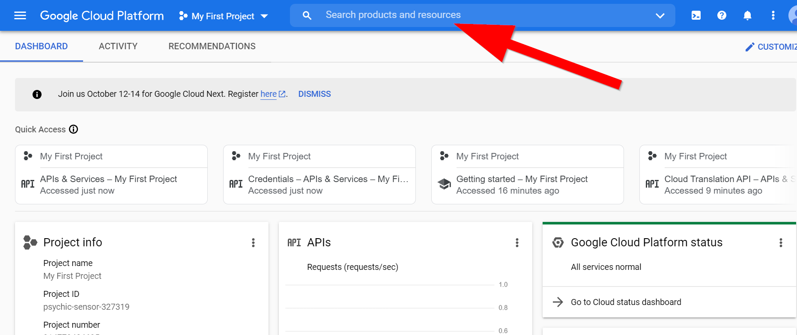
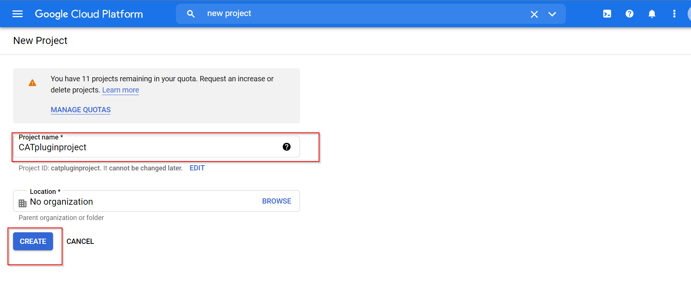
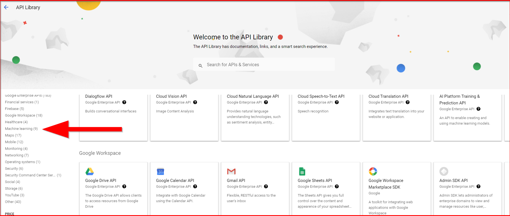
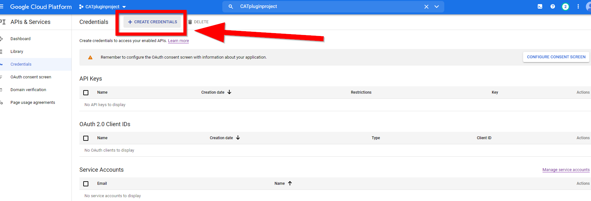

# How to obtain API keys for MT plugins  

## Amazon Translate (AWS)  

Create an **[AWS account](https://aws.amazon.com/)**
  

1. You need your debit/credit card to accomplish this step. One USD/EUR is then temporarily charged to your bank account. Provide your personal details. In the next step select the payment plan:  

  

2. Next, configure your account locally. Download and install the **[AWS CLI](https://aws.amazon.com/cli/)** (Command Line Interface). Additional information on how to accomplish this task may be found in the **[AWS Documentation](https://docs.aws.amazon.com/cli/latest/userguide/awscli-install-windows.html)**.  

  

3. Look for necessary credentials in your **AWS Management Console**.  
 
4. Click the name of your account in the upper, right corner of the page.  

5. Select **My Security Credentials**.  

6. Click **Access keys (access key ID and secret access key)**.  
 
7. Generate the key. Download the key file. Remember to store it in a safe place.  
 
8. Run AWS CL by **[opening a windows command prompt](https://www.lifewire.com/how-to-open-command-prompt-2618089).** Type in `aws configure`.  
 
9. When prompted enter the required data. Confirm by pressing Enter after each line. When prompted for the **Default region name** enter `us-west-2` or follow the instructions given here: [https://docs.aws.amazon.com/general/latest/gr/rande.html](https://docs.aws.amazon.com/general/latest/gr/rande.html).  

10. Type in `aws configure` again. This is an example of what you should see then:  

  

You have successfully set up your AWS credentials, incl. your API key.  

## 4.2 DeepL  

Create a DeepL account [here](https://www.deepl.com/pro.html)  

1. Select DeepL Pro payment plan. You need your debit/credit card to register your account. Provide your personal details. Confirm each step.  

 
2. Press **Retrieve your Authentication Key** on the last screen. 

3. Go to **Account**. Your API key is at the bottom of the screen under ** Authentication Key for DeepL API**. Copy it and store it in a safe location.  

## 4.3 ModernMT  

Create a ModernMT account [here](https://www.modernmt.com/pricing/).  

1. Click **Plugins for translators** > **Get a license**.  

2. You need your debit/credit card to register your account. Provide your personal details.  

3. Click **Start your plan**.  

4. Copy your activation key from the **Here’s your activation key** field. Store it in a safe location.  

## Google Cloud Translation Basic (or Google Translate API v2)  

To use this MT vendor you need to have your regular Google Account. Set it up and log in to it. Then log in [here](https://console.developers.google.com/cloud-resource-manager).

1. Go to **Billing** > **Add a billing account**. Accomplish all the required steps of the procedure.  
 
  

2. You should find yourself in the **Dashboard** view. As there are frequent changes to the **Google Cloud Platform** the page you find yourself may be different.  

  

3. Type in `new project` in the search window. Click **Create a Project IAM & Admin**.  
 
  

4. Assign a name to your project in the **Project name** field (for example **CATpluginproject**). Write it down for future use. Click **Create**.  

  

5. Type in your project name in the search window and press **Enter**. Click the project name in the results window.  

6. In the upper, left corner of the page, the drop-down menu has changed its name to the name of your project. Open the menu, and click the name of this project (for example **CATpluginproject**).  

   

7. The name of your project is now visible in the **Search** window in the middle of the upper part of the page. Click **Menu** (three horizontal lines one under another in the left corner) > **APIs & services**.  

 

8. Click **ENABLE APIS AND SERVICES**.  
 

9. In the left margin click **Machine Learning**.  
 

10. Click **Cloud Translation API** > **Enable**.  
 
  
  

11. To use this API, you need credentials. Click **Create credentials** to get started.  
 

12. From the **Select an API** drop-down menu select **Cloud Translation API**.  
 
  

13. Click **Cancel**.  
 
  

14. In the upper part of the dashboard, click **CREATE CREDENTIALS** > **API key**.  
 
  
  

15. Wait for the API key to be created. Remember to copy it and store it in a safe location. Click **RESTRICT KEY** to prevent unauthorized use in production.  
 
   

16. Allow the **Restrict key** option. In the drop-down menu select **Cloud Translation API**. Click **Save**.  
  
  

You now have your API key set up.  
