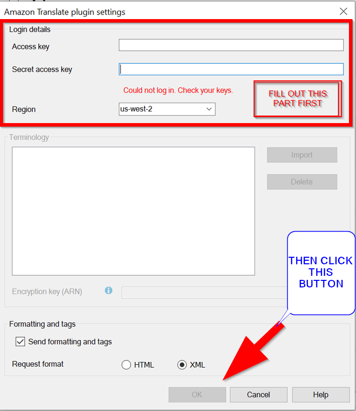
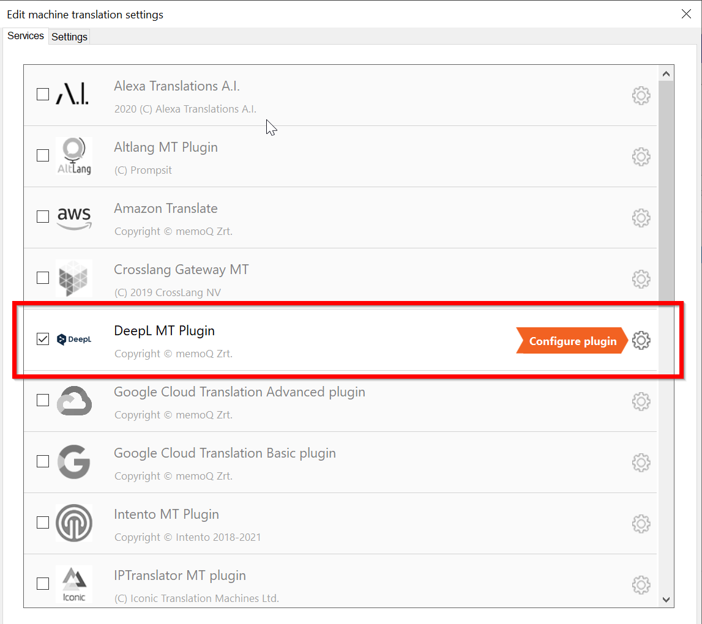
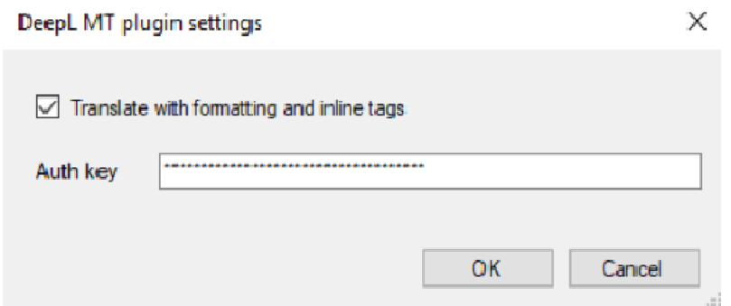
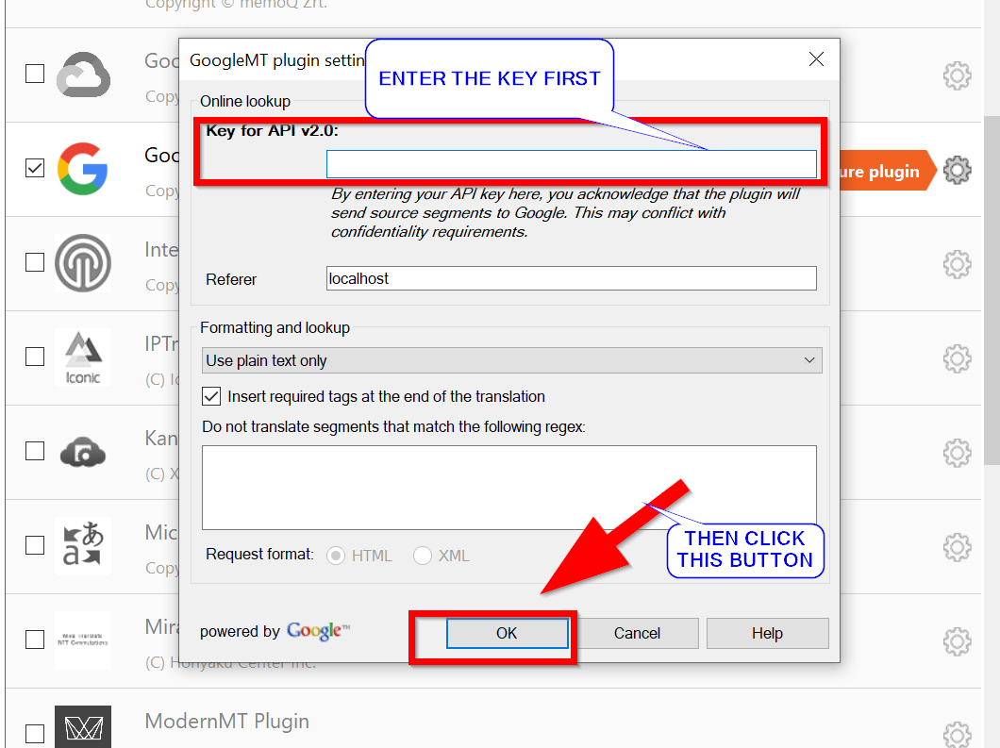

## How to set up machine translation plugins in memoQ Translator Pro 9.8™  

## Amazon Translate (AWS)  

### How to obtain an API key  

Read [here](api-keys.md#amazon-translate-aws) for more details.  

### How to set up the memoQ Translator Pro 9.8™ plugin for Amazon Translate (AWS) (for a local profile)  

1. Click **memoQ** tab in the upper, left corner of the dashboard.
 

2. Click **Options**. A new pane appears. Click **Options** in the **memoQ options** menu. Wait for the **Default resources** pane to open.
 

3. At the top of the pane, there is a row of icons. Click the **MT Settings** icon, which is the first icon from the right.
 
4. If you have already set up an MT profile or profiles, select one of them from the list and click **OK** to confirm that you read the message > **Edit**.
	

5. If you have not set up an MT profile yet, open the **Language** drop-down menu, and select a language. In the **Name/description** field enter a name. Click **Create new** at the bottom of the pane. In the **Create new MT settings** window enter the name and description.
	Click **OK**. Check the new profile visible in the list. Click **OK** to confirm that you read the message > **Edit**.
	

6. In the **Edit machine translation settings** windows go to the **Services** tab and check the **AWS Amazon Translate** plugin. Click **OK** to confirm that you read the message. To prevent this message from displaying again, check **Do not show this warning** option. Click the cogwheel icon or double-click the name of the plugin.

 

7. In the **Amazon Translate plugin settings** enter your Access key and Secret access key in the two text fields. Select your region from the Region drop-down menu. It must be the same region as the one specified in your Amazon credentials. More information about other options available in this window is available **[here](https://docs.memoq.com/current/en/Places/amazon-mt-plugin-settings.html)**.  Click **OK**, then click **OK** again.  

 
  

You may start using this service now.  

## DeepL  

### How to obtain an API key  

Read [here](api-keys.md#deepl) for more details.  

### How to set up the memoQ Translator Pro 9.8™ plugin for DeepL  

1. Click **memoQ** tab in the upper, left corner of the dashboard.  

  

2. Click **Options**. A new pane appears. Click **Options** in the **memoQ options** menu. Wait for the **Default resources** pane to open.  

  

 
3. At the top of the pane, there is a row of icons. Click the **MT Settings** icon, which is the first icon from the right.  

4. If you have already set up an MT profile or profiles, select one of them from the list and click **OK** to confirm that you read the message > **Edit**.  

  

 
5. If you have not set up an MT profile yet, open the **Language** drop-down menu, and select a language. In the **Name/description** field enter a name. Click **Create new** at the bottom of the pane. In the **Create new MT settings** window enter the name and description. Click **OK**. Check the new profile visible in the list. Click **OK** to confirm that you read the message > **Edit**.  

	
  

 
6. In the **Edit machine translation settings** windows go to the **Services** tab and check the **DeepL MT Plugin**. Click **OK** to confirm that you read the message. To prevent this message from displaying again, check **Do not show this warning** option. Click the cogwheel icon or double-click the name of the plugin.  

  

7. In the **DeepL MT plugin settings** enter your DeepL API key in the **Auth key** field.  Click  **OK**.  Check the  **Enable plugin**  check box in the list of machine translation plugins. Click  **OK**  again to close the  **Options** dialog.  

  

You may start using this service now.  

## ModernMT  

### How to obtain an API key  

Read [here](api-keys.md#modernmt) for more details.   

### How to set up the memoQ Translator Pro 9.8™ plugin for ModernMT  

1. Click **memoQ** tab in the upper, left corner of the dashboard.  

  

2. Click **Options**. A new pane appears. Click **Options** in the **memoQ options** menu. Wait for the **Default resources** pane to open.  

  

 3. At the top of the pane, there is a row of icons. Click the **MT Settings** icon, which is the first icon from the right.  

 
 4. If you have already set up an MT profile or profiles, select one of them from the list and click **OK** to confirm that you read the message > **Edit**.  

  

 5. If you have not set up an MT profile yet, open the **Language** drop-down menu, and select a language. In the **Name/description** field enter a name. Click **Create new** at the bottom of the pane. In the **Create new MT settings** window enter the name and description. Click **OK**. Check the new profile visible in the list. Click **OK** to confirm that you read the message > **Edit**.  

	
  

6. In the **Edit machine translation settings** windows go to the **Services** tab and check the **Modern MT Plugin**. Click **OK** to confirm that you read the message. To prevent this message from displaying again, check **Do not show this warning** option. Click the cogwheel icon or double-click the name of the plugin.  

   

 
7. In the **Modern MT settings** enter your Modern MT API key in the field. Click  **Login**.  

   

 
8. You may select one or more translation memories to use with your project. Check the **Use** check box for each translation memory you wish to use. If you check the **Update** check box of a translation memory, it will learn from the corrections you make in a given translation. You may select this check box for only one translation memory.  

 
   
 
You may start using this service now.

## Google Cloud Translation Basic (or Google Translate API v2)  

### How to obtain an API key  

Read [here](api-keys.md#google-cloud-translation-basic-or-google-translate-api-v2) for details.  

### How to set up the memoQ Translator Pro 9.8™ plugin for Google Cloud Translation Basic (or Google Translate API v2)  

1. Click **memoQ** tab in the upper, left corner of the dashboard.  

  

2. Click **Options**. A new pane appears. Click **Options** in the **memoQ options** menu. Wait for the **Default resources** pane to open.  

 

 
3. At the top of the pane, there is a row of icons. Click the **MT Settings** icon, which is the first icon from the right.  

 
4. If you have already set up an MT profile or profiles, select one of them from the list and click **OK** to confirm that you read the message > **Edit**.  

  

5. If you have not set up an MT profile yet, open the **Language** drop-down menu, and select a language. In the **Name/description** field enter a name. Click **Create new** at the bottom of the pane. In the **Create new MT settings** window enter the name and description. Click **OK**. Check the new profile visible in the list. Click **OK** to confirm that you read the message > **Edit**.  

  

6. In the **Edit machine translation settings** windows go to the **Services** tab and check the **Google Cloud Translation Basic plugin**. Click **OK** to confirm that you read the message. To prevent this message from displaying again, check **Do not show this warning** option. Click the cogwheel icon or double-click the name of the plugin.  

 
  

 
7. In the **Google MT Plugin settings** enter your Google API key in the **Key for API v2.0** field. Do not change the text in the **Referer**  box. Click  **OK**.  Check the  **Enable plugin**  check box in the list of machine translation plugins. Click  **OK**  again to close the  **Options**  dialog.  

 
  

 
You may start using this service now.  

